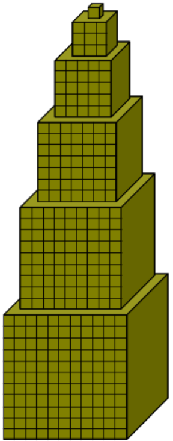

**Notions abordées** : 

- boucles condionnelles non bornées ( `for`  `in range` )

- boucles itératives bornées (`while` )

- arrêt et sortie d'une boucle ( `break` )

# UAA11 TP4-1 : Les Boucles conditionnelles

**Mémo**

- Prends connaissance du cours sur les [tests](NSI Première Partie 1 Chapitre 5 Boucles.pdf) , fais les activités ci-dessous puis réponds aux questions **QCM** du pdf.

- Tu peux tester ton code avec l'IDE du chapitre "TBD. Bac à sable"

- Complète ton fichier "**memo**" que tu complèteras avec ce que tu as appris au fur et à mesure de ton avancement dans le cours.

## 1. Découverte des boucles conditionnelles `while ...`
 
??? question  "Test 1 : Mystère"

    On considère le code suivant :

    {{IDE('nsi_cond/test1_myst')}}
    
    Que renvoie la fonction `mystere` ? Donnes-une interprétation concrète.
    
??? question  "Test 2 : Placement bancaire"

    On dépose une somme d'argent sur un compte rémunéré et on désire savoir combien d'années on doit attendre avant que la somme disponible sur ce compte ait atteint une valeur particulière. On veut aussi connaître la somme disponible réellement à cet instant, au centime d'euro près.

    En t'aidant de la fonction écrite à l'exercice précédent, complète la fonction `placement_bancaire_seuil` pour qu'elle renvoie la réponse à ce problème.

    {{IDE('nsi_cond/test2_placement')}}

??? question  "Test 3 : Culture de bactéries"

    A l'instant $t=0$, on met en culture une population de bactéries qui augmente de $10,5\%$ toutes les heures.

    En t'aidant des fonctions écrites aux tests 1 et 2, écris une fonction **`attente_seuil_bacteries`** prenant en paramètres deux entiers `pop_initiale` et `pop_finale` correspondant respectivement à la taille initiale de la population mise en culture et à la taille de la population que l'on veut atteindre, et renvoyant le nombre d'heures à attendre pour atteindre cette taille.

    {{IDE('nsi_cond/test3_bacteries')}}

??? question  "Test 4 : Jeu de rôle"

    Dans un jeu, un joueur dispose de `250` points de vie. Il subit des attaques successives dont les valeurs sont des nombres entiers aléatoires entre `10` et `40`.

    Lorsque le nombre de points de vie du joueur devient négatif ou nul, on dit que le joueur s'évanouit.

    1. complète le code de la fonction ci-dessous afin qu'elle renvoie le nombre d'attaques que le joueur peut subir jusqu'à ce qu'il s'évanouisse.

        {{IDE('nsi_cond/test4a_jeu_role')}}

    2. Le joueur dispose à présent d'une défense de `25`. Lorsqu'il subit une attaque de valeur `attaque`, on applique la règle suivante :
 
        : si la valeur de l'attaque est strictement supérieure à celle de la défense, le joueur perd `attaque : 25` points de vie ;
     
        : si la valeur de l'attaque est inférieure ou égale à celle de la défense, le joueur ne perd aucun point de vie.

        complète la fonction suivante afin qu'elle renvoie le nombre d'attaques que le joueur peut subir dans ces conditions jusqu'à ce qu'il s'évanouisse.

        {{IDE('nsi_cond/test4b_jeu_role')}}

    3. On modifie la fonction précédente en une fonction `nb_attaques_aléatoires_points_vie_défense` pour qu'elle fonctionne avec n'importe quel nombre de points de vie, n'importe quelle défense et des attaques successives prenant des valeurs entières aléatoires entre deux nombres entiers prédéfinis en respectant la règle suivante :

        : si la valeur de l'attaque est strictement supérieure à celle de la défense, le joueur perd `attaque : défense` points de vie ;
 
        : si la valeur de l'attaque est inférieure ou égale à celle de la défense, le joueur ne perd aucun point de vie.

        Ecris ci-dessous le code de cette fonction où les paramètres sont définis de la façon suivante :
 
        : `points_vie` est le nombre de points de vie initial du joueur ;
 
        : `défense` est la défense du joueur ;
 
        : `val_min_attaque` est la valeur minimale que peut prendre une attaque ;
 
        : `val_max_attaque` est la valeur maximale que peut prendre une attaque.

        Tous les paramètres de la fonction sont des nombres entiers strictement positifs.

        {{IDE('nsi_cond/test4c_jeu_role')}}

??? question  "Test 5 : lancers d'un dé"

    On lance plusieurs fois un dé équilibré à six faces numérotées de $1$ à $6$ et on regarde le nombre de lancers qu'il a fallu effectuer pour obtenir le $6$ pour la première fois.

    Complète la fonction suivante afin de simuler cette expérience.

    A quoi sert l'instruction `face = 0` avant la boucle `while` ?

    {{IDE('nsi_cond/test5_1de')}}

??? question  "Test 6 : Lancers de 2 dés (partie 1)"

    On lance plusieurs fois deux dés équilibrés à six faces numérotées de $1$ à $6$ et on regarde le nombre de lancers qu'il a fallu effectuer pour obtenir deux faces identiques pour la première fois.

    En t'aidant de la fonction écrite à l'exercice précédent, écris une fonction `nb_lancers_deux_des_faces_identiques` permettant de simuler cette expérience.

    {{IDE('nsi_cond/test6_2des_part1')}}
    
## 2. Pour aller plus loin dans la découverte ...

??? question  "Test 7 : Lancers de 2 dés (partie 2)"

    On lance plusieurs fois deux dés équilibrés à six faces numérotées de $1$ à $6$ et on regarde le nombre de lancers qu'il a fallu effectuer pour obtenir :
 
    1. un double-six pour la première fois (expérience 1);
 
    2. un double-quatre pour la première fois (expérience 2).

    En t'aidant de la fonction écrite à l'exercice précédent, écris deux fonctions **`nb_lancers_deux_des_double_six`** et **`nb_lancers_deux_des_double_quatre`** permettant de simuler ces deux expériences.

    Comment peux-tu optimiser ton code en n'écrivant une seule fonction **`nb_lancers_deux_des_double(face)`**, face étant passé en paramètre lors de l'appel de la fonction.

    {{IDE('nsi_cond/test7_2des_part2')}}

??? question  "Test 8 : Lancers de 2 dés (partie 3)"

    On lance plusieurs fois deux dés équilibrés à six faces numérotées de $1$ à $6$ et on regarde le nombre de lancers qu'il a fallu effectuer pour obtenir un double-six pour la seconde fois.

    En t'aidant de la fonction écrite à l'exercice précédent, complète la fonction **`nb_lancers_deux_dés_double_six_deux_fois`** ci-dessous permettant de simuler cette expérience.

    {{IDE('nsi_cond/test8_2des_part3')}}

## 3. QCM Boucles conditionnelles

??? tip "Solutions du QCM 3.6 p47 du pdf"
    1. a, d
    2. c
    3. b, d
    4. d
    5. a

## 4. Exercices

??? question  "Test 1 : Somme des entiers jusqu'à n"

    Ecris une fonction **`somme_int(n)`** qui renvoie la somme des n 1ers entiers naturels.

    {{IDE('exos_cond/test1_somme_int')}}

    ??? tip "Astuce"

        Dans une boucle, définis une variable `c` pour le compteur de 1 à 10 par exemple, et une variable `s` pour la somme cumulée de `c`.
        
        Pour bien comprendre le mécanisme, prends l'habitude pendant l'écriture du code d'afficher toutes les variables que tu utilises dans la boucle (ici `c` et `s`) et vérifie les calculs pour les 1ers et derniers passages dans la boucle.

        ```python
            >>> somme_int(10)
            c           s
            1			1
            2			3
            3			6
            4			10
            5           15
            6           21
            7           28
            8           36
            9           45
            10          55
        ```

??? question  "Test 2 : Réponse correcte"

    Ecris une fonction **`rep_correcte`** qui demande un nombre de départ compris entre 10 et 20 jusqu’à ce que la réponde soit correcte.

    ```python
        >>> rep_correcte()
        Entre un nombre entre 10 et 20
        5
        Nombre pas corect.
        Entre un nombre entre 10 et 20
        24
        Nombre pas corect.
        Entre un nombre entre 10 et 20
        16
        Nombre correct
    ```
    {{IDE('exos_cond/test2_rep_correcte')}}

??? question  "Test 3 : Nombre mystère"

    L’ordinateur tire un nombre inférieur à 100 au hasard.

    L’utilisateur doit découvrir le nombre tiré en un minimum d’essais sachant que l’ordinateur lui répond pour chaque essai si le nombre tiré est plus grand ou plus petit que celui que l'utilisateur propose.

    Ecris une fonction **`nb_mystere`** qui renvoie le nombre d’essais nécessaires pour trouver le nombre tiré par l'ordinateur.

    ```python
        >>> nb_essais = nb_mystere()
        Choisis un nombre
        50
        c'est moins !
        Choisis un nombre
        25
        C'est plus !
        Choisis un nombre
        37
        C'est plus !
        Choisis un nombre
        43
        >>> print("Bravo, t'as trouvé le nombre mystère! en ", nb_essais, "coups")
        "Bravo, t'as trouvé le nombre mystère! en 3 coups"
    ```
    {{IDE('exos_cond/test3_nb_mystere')}}

??? note  "Test 4 : 10 nombres consécutifs ( ==Maison== )"

    Ecris une fonction **`nbs_consecutifs(nb)`** qui à partir d'un nombre de départ `nb` compris entre 10 et 20, affiche les dix nombres suivants.

    ```python
        >>> nb =int(input("Entre un nombre"))
        17
        >>> print("Les 10 nombres suivants sont: ", nbs_consecutifs(nb))
        Les 10 nombres suivants sont:
        18
        19
        20
        21
        22
        23
        24
        25
        26
        27
    ```   
    {{IDE('exos_cond/test4_nb_consecutifs')}}

??? question  "Test 5 : Températures"

    Ecris une fonction **`temp(t1, t2)`** qui affiche toutes les températures comprises entre 2 températures `t1, t2`, (bornes incluses).

    ```python
        >>> temp(9, 14)
        9
        10
        11
        12
        13
        14
    ```
    {{IDE('exos_cond/test5_temp')}}

??? note  "Test 6 : Table de multiplication ( ==Maison== )"

    Ecris une fonction **`table_multi(nb)`** qui affiche la table de multiplication du nombre `nb`.
    ```python
        >>> table_multi(7)
        Table de 7 :
        7 x 1 = 7
        7 x 2 = 14
        7 x 3 = 21
        …
        7 x 10 = 70
    ```
    Teste-là en entrant le nombre au clavier (voir le test-ci-dessous)

    {{IDE('exos_cond/test6_table_mult')}}

??? question  "Test 7 : Conv en euros, dollars ([1-AppPy] 4.3 p31)"

    Écris une fonction **`conv_euro_dollars` **qui affiche une table de conversion de sommes d’argent exprimées en euros, en dollars canadiens. 
    
    La progression des sommes de la table sera "géométrique".

    ```python
        >>> conv_euro_dollars()
        1 euro(s) = 1.65 dollar(s)
        2 euro(s) = 3.30 dollar(s)
        4 euro(s) = 6.60 dollar(s)
        8 euro(s) = 13.20 dollar(s)
        etc. (s’arrêter à 16384 euros.)
    ```
    {{IDE('exos_cond/test7_conv_euros_dollars')}}

??? question  "Test 8 : Nombres triples ( [1-AppPy] 4.4 p31 )"

    Ecris une fonction **`nb_triple(nb)`** qui affiche à partir de `nb`, une suite de 12 nombres dont chaque terme est égal au triple du terme précédent.

    ```python
        >>> nb_triple(1)
        1 3 9 27 81 243 729 2187 6561 19683 59049 177147
    ```
    {{IDE('exos_cond/test8_nb_triple')}}

??? note  "Test 9 : Table de 7  ([1-AppPy] 4.7 p35 ) ( ==Maison== )"

    A partir de la fonction `table_multi(nb)`, écris une fonction **`table7`** qui affiche les 20 premiers termes de la table de multiplication par 7, en signalant au passage (à l’aide d’une astérisque) ceux qui sont des multiples de 3.

    ```python
        >>> table7()
        7 14 21 * 28 35 42 * 49 56 63 * 70 77 84 * 91 98 105 * 112 119 126 * 133 140
    ```
    {{IDE('exos_cond/test9_table7')}}

??? note  "Test 10 : Table de 13 ( [1-AppPy] 4.8 p35 ) ( ==Maison== )"

    Écris une fonction **`table13`** qui calcule les 50 premiers termes de la table de multiplication par 13, mais n’affiche que ceux qui sont des multiples de 7.

    ```python
        >>> table13()
        91 182 273 364 455 546 637 
    ```
    {{IDE('exos_cond/test10_table13')}}

??? question  "Test 11 : Pyramide d’astérix * ( [1-AppPy] 4.9 p35)"

    Écris une fonction  **`pyramide(nb)`** qui affiche `nb` lignes de symboles suivants :

    ```python
        >>> pyramide(7)
        *
        **
        ***
        ****
        *****
        ******
        *******
    ```
    {{IDE('exos_cond/test11_pyramide')}}

??? note  "Test 12 : Somme d'entiers ( ==Maison== )"

    Ecris une fonction **`somme(nb)`** qui à partir d'un nombre de départ nb, renvoie la somme des entiers jusqu’à ce nombre.

    RY    assert somme(5) == 15

    {{IDE('exos_cond/test12_somme')}}

??? question  "Test 13 : Multiplications par additions successives"

    Ecris une fonction  **`multiplication(a, b)`** qui renvoie le produit de deux entiers naturels a, b  en effectuant des additions successives **mais** sans utiliser la multiplication :
    
    $a * b = a + a + … + a$  (b fois)

    Par exemple $3 * 5$ sera calculé en additionnant 3 5 fois : $3 * 5 = 3 + 3 + 3 + 3 + 3$

    ??? tip "Conseil"
        """
        Si tu ajoutes un `print` dans la boucle, tu peux observer le calcul étape par étape:
        ```python
            3
            6
            9
            12
            15
        ```
    {{IDE('exos_cond/test13_multiplication')}}

??? question  "Test 14 :  Puissances par multiplications successives"

    Ecris une fonction  **`puissance(a, b)`**   qui renvoie la puissance de deux entiers naturels `a, b `en effectuant des multiplications successives sans utiliser la puissance :
    
    $a^b$ = a * a * … * a (b fois)
    
    Par exemple $3^5$ sera calculé en multipliant 3 5 fois; $3^{5} = 3*3*3*3*3$

    {{IDE('exos_cond/test14_puissance')}}

??? question  "Test 15 : Factorielle"

    Ecris une fonction  **`factorielle(n)`**  permettant de calculer la factorielle d'un entier naturel `n`.

    Par exemple, la factorielle de 8, notée $8 !$, vaut $8 * 7 * 6 * 5 * 4 *3 * 2 * 1$

    {{IDE('exos_cond/test15_factorielle')}}

??? question  "Test 16 : Diviseurs d'un entier"

    Ecris une fonction  **`diviseurs(n)`**  qui affiche les diviseurs d’un entier naturel `n` par ordre croissant: 
    
    RY
    ```python
        >>> diviseurs(24)
        1 2 3 4 6 8 12 24
    ```

    ??? tip "Démarche"

        - pars d'un exemple concret : n = 24

        - affiche un compteur `c` de 1 jusqu'à 24

        - quel test peux-tu effectuer pour vérifier si `c` est un diviseur de 24 ?

        - n'affiche que les valeurs de `c` qui sont des diviseurs de 24

        - ton code marche, est-ce qu'il pas possible de faire moins d'itérations ?

    {{IDE('exos_cond/test16_diviseurs')}}

??? question  "Test 17: Nombre parfait"

    Un nombre est parfait s’il est égal à la somme de ses diviseurs stricts (différents de lui-même). 

    Ainsi par exemple, l’entier 6 est parfait car $6 = 1 + 2 + 3$. 

    Ecris une fonction  **`nb_parfait(n)`**  qui renvoie `True` si un entier naturel `n` est un nombre parfait, `False` dans le cas contraire.

    ??? tip "Démarche"

        - pars du code de la fonction précédente `diviseurs(24)`

        - affiche un compteur `s` qui additionne les diviseurs de 24

        - quel test peux-tu effectuer entre ce `s` et 24 ?

    {{IDE('exos_cond/test17_nb_parfait')}}

??? question  "Test 18 : Nombre le plus grand"

        1. Ecris une fonction  **`maximum()`**  qui demande successivement 5 nombres positifs à l’utilisateur, et qui renvoie le plus grand nombres parmi les 5.

        RY
        ```python
            >>> print(maximum())
            12
            14
            8
            13
            6

            14
        ```

        2. Modifie la fonction pour qu'elle renvoie en quelle position ce nombre a été saisi.
        RY
        ```python
            >>> print(maximum())
            12
            14
            8
            13
            6

            14
            1
        ```
        
        3. Cette fois-ci on ne connaît pas en avance combien l’utilisateur souhaite saisir de nombres.
        
            Modifie la fonction pour que la saisie des nombres s’arrête lorsque l’utilisateur entre un nombre négatif.

    {{IDE('exos_cond/test18_maximum')}}

??? note  "Test 19: pgcd, ppcm ( ==!!! CHALLENGE !!!== )"

    Ecris une fonction  **`pgcd_ppcm(n)`**  qui renvoie les pgcd et ppcm (plus grand commum diviseur et plus petit commun multiple) d'un entier naturel `n`.

    {{IDE('exos_cond/test19_pgcd_ppcm')}}

??? question  "Test 20: Nombre premier"

    Un nombre premier est un nombre divisible que par 1 et lui même.

    Ecris une fonction  **`nb_1er(n)`**  qui renvoie `True` si un entier naturel `n` est un nombre premier, `False` dans le cas contraire.

    ??? tip "Démarche"

        Si tu écris un compteur de 2 à 28,  combien de fois 29 est-il divisible par c ?

        Comment peux-tu optimiser ton code pour écrire une fonction **`nb_parfait_1er(n)`** qui renvoie 2 booléens, le 1er renvoie le le nombre est parfait, le 2ème s'il est premier ?

    {{IDE('exos_cond/test20_nb_1er')}}

??? note  "Test 21: nbs 1ers inférieurs à n ( ==Maison== )"

    Ecris une fonction  **`nbs_1er_inf(n)`**  qui affiche tous les nombres premiers inférieurs à `n`.

    {{IDE('exos_cond/test21_nbs_1er_inf')}}

??? note  "Test 22 : nombres jumeaux inférieurs à n ( ==!!! CHALLENGE !!!== )"

    2 nombres premiers sont jumeaux si leur différence vaut 2 (par exemple, 5 et 7 sont deux nombres premiers jumeaux). 
    
    Ecris une fonction  **`nbs_jumeaux(n)`**  qui affiche tous les couples de nombres premiers jumeaux inférieurs à `n`.

    ```python
        >>> nbs_jumeaux(50)
            7 5
            13 11
            19 17
            31 29
            43 41
        ```

    {{IDE('exos_cond/test22_nbs_jumeaux')}}

??? note  "Test 23 : Socle statue ( ==Maison== )"

    Le socle d'une statue est constitué d'étages, chaque étage ayant une base carrée et une hauteur égale à une unité. Le côté des carrés diminue d’une unité à chaque étage.
    
    Ecris une fonction  **`vol_socle_statue(lgrsol, lgrsup)`**  qui, à partir de la largeur du socle au niveau du sol `lgrsol` et de la largeur au niveau de la face supérieure `lgrsup` pas, renvoie le volume du socle.
    
    <center> { width=50% } </center>

    {{IDE('exos_cond/test23_vol_socle_statue')}}

??? note  "Test 24 : Pyramide ( ==Maison== )"

    Ecris une fonction  **`cubes_pyramide(nbcote)`**  qui, à partir du nombre de cubes sur un côté de la grande base au sol `nbcote` renvoie le nombre de cubes nécessaires à la construction de la pyramide ci-contre.

    <center> { width=15% } </center>

    {{IDE('exos_cond/test24_cubes_pyramide')}}

??? question  "Test 25 : Calcul du $n^{ième}$ terme d’une suite"

    1. Ecris une fonction  **`u(n, a, b, c)`**  qui, à partir de 3 entiers a, b, c, renvoie le $n^{ième}$ terme de la suite

        $u_{1} = a$

        $u_{n} = b.u_{n-1} + c$ pour $n > 1$

        - Avec quels paramètres appellerais-tu la fonction pour calculer $u_{8}$ pour une suite géométrique avec $u_{1} = 1$ et $q = 2$ ?

        - Avec quels paramètres appellerais-tu la fonction pour calculer $u_{8}$ pour une suite arithmétique avec $u_{1} = 1$ et $r = 2$ ?

        - Avec quels paramètres appellerais-tu la fonction pour calculer $u_{6}$ pour la suite :
                
            $u_{1} = 2$

            $u_{n} = 3.u_{n-1} + 4$ pour $n > 1$

    2. Ecris une fonction  **`v(n)`**  qui renvoie le $n^{ième}$ terme de la suite

        $101$		$-303$		$909$	$…$

    3.  Ecris une fonction  **`w(n)`** qui renvoie le $n^{ième}$ terme de la suite
    
        $w_{n} =  \dfrac{n .  (-1)^n}{n+1}$

    {{IDE('exos_cond/test25_un_suites')}}

??? question  "Test 26 : Suite de Fibonnaci"

    Ecris une fonction  **`F(n)`**  qui renvoie le $n^{ième}$ terme de la suite de Fibonacci définie par:

	    F(n) : F(0) = 0, F(1) = 1

	    F(n) =F(n-1) + F(n-2)
    
    {{IDE('exos_cond/test26_fibonnaci')}}

## 5. Remédiation

??? note "France IOI (==Remédiation==)"

    Vas sur le [site de France IOI](https://www.france-ioi.org/algo/chapters.php) et fais dans les chapitres suivants :

    - **Niveau 1, 2 – Répétitions d’instructions 1) à 10)**

    - **Niveau 1, 3 – Calculs et découverte des variables 6) à 12)**

    - **Niveau 1, 4 – Lecture d’entrées 4) à 10)**
