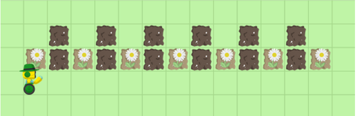
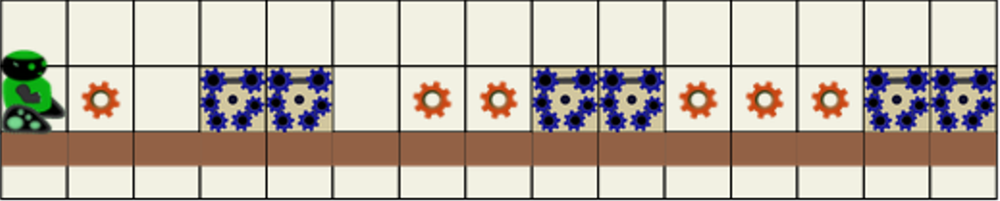
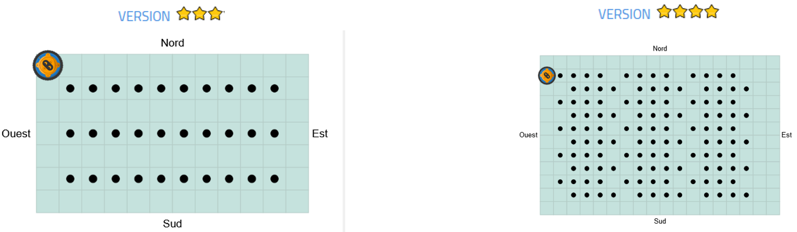
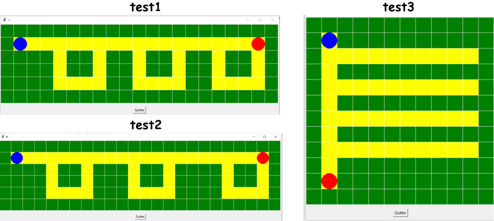

# UAA11 TP7 - Les listes imbriquées

**Notions abordées** : 
TBD

## 1. Les boucles imbriquées (rappels de 4ème)

???+ question "Consigne"
    Vas sur le site d'auto-apprentissage en ligne [Algorea](https://parcours.algorea.org/contents/4707-4702-1471479157476024035) et suis la sélection d'exercices suivante.

### **Test1 - ==Algo-3== Répéter une séquence**

???+ question "Consigne"
    Vas sur le chapitre **Donner plusieurs fois la même séquence d’ordre au robot – [1 Planter des fleurs](https://parcours.algorea.org/fr/a/1729868925288998622;p=4702,1471479157476024035,1650344846863352556,1360413068213744434;pa=0)**

    { width=50% }

### **Test2 - ==Algo-8== Fonctions**

???+ question "Consigne"

    Vas sur le chapitre **Créer ses propres blocs : Introduction aux fonctions – [1 Construire une machine](https://parcours.algorea.org/fr/a/847449815220110960;p=4702,1471479157476024035,1261521880802626413,1253854401246137378;pa=0)**

    { width=50% }

### **Test3 - ==Algo-4== Boucles imbriquées**

???+ question "Consigne"
    Vas sur le chapitre **Concevoir des programmes compacts : Boucles imbriquées – [4 Peindre le motif](https://parcours.algorea.org/fr/a/999240940119456938;p=4702,1471479157476024035,811541682595963124,1345416687733179145;pa=0)**

    { width=50% }

### **Test4 - Idle : synthèse**

???+ question "Consigne"

    1. Télécharge le [fichier compressé](tp1-4_algorea_synthese.zip) décompresse les fichiers et déplace-les dans ton dossier de travail.

    2. Ouvre le fichier **test.py** avec **idle** et exécute-le. L’appel des test1, 2, 3 se fait en modifiant l’instruction en fin de code **test1()** par **test2()** ou **test3()**

    3. Déplace le point bleu jusqu’au point rouge en passant par toutes les cases jaunes.

        Tu dois utiliser un minimum d’instructions, le déplacement se fait grâce à : **est(), ouest(), nord(), sud()**

    4. Démarche :
        - Pense à bien repérer sur la figure le bout de dessin qui se répète.

        - Ecris tout d’abord le code pour parcourir ce bout de dessin.

        - Complète-le pour parcourir toute la figure.

    { width=70% }
